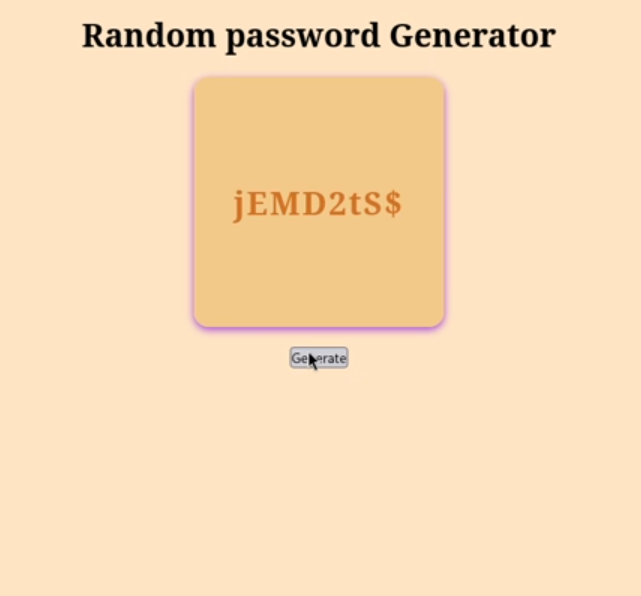

# Password Generator Project with GUI Using JavaScript 🔐🖥️

## Overview
This project is a web-based password generator with an interactive graphical user interface (GUI) built using HTML, CSS, and JavaScript. It allows users to generate strong, random passwords by selecting desired criteria such as length, inclusion of uppercase/lowercase letters, numbers, and symbols.

---

## Features ✨
- Customizable password length with a slider 🔢
- Options to include lowercase, uppercase, numbers, and special symbols ✔️
- Real-time password generation as options change 🔄
- Visual password strength indicator 📊
- Copy password to clipboard with a single click 📋
- Dark and light mode toggle 🌙☀️

---

## Technologies Used 🛠️
- HTML5 for structure
- CSS3 for styling and responsive design
- JavaScript (ES6) for logic and interactivity

---

## Installation & Usage ⚙️
- Download or clone the repo
- Open `index.html` in any modern browser
- Use sliders and checkboxes to customize your password
- Click the "Generate" button to create your password
- Click "Copy" to save the password to your clipboard

---

## How It Works 🔍
- JavaScript collects user preferences on password criteria
- Generates random password based on selected options
- Validates password strength and provides feedback
- Supports toggling between light and dark UI themes

---

## Screenshot

---

## Example Code Snippet

